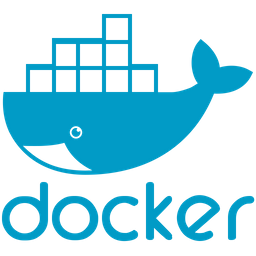
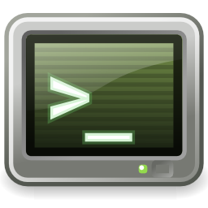
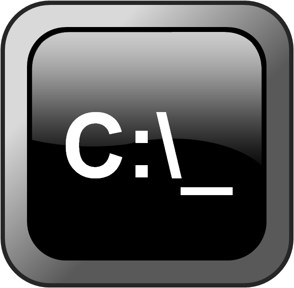
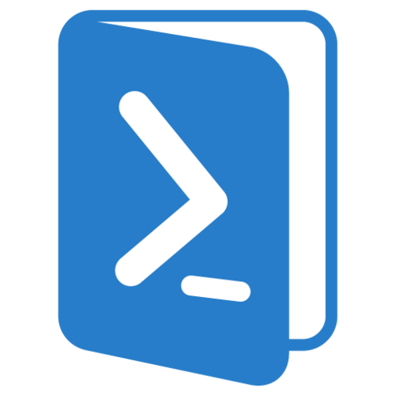

# Bem vindo ao Website de Informações do Fanto

  

    B3M V1ND0 40 C0NH3C1M3NT0

---

 

  <code style="color: magenta">PÁGINAS DE VIDEOS PUBLICADOS E INTERESSANTES</code>

 

Link para Página|Informações|Imagem
|---|---|---|
[Página Inicial dos Vídeos de Git](pages/yt_git/home.md)| Vídeos que publiquei sobre Git|

 

  <code style="color : magenta">PÁGINAS DE LINGUAGENS DE PROGRAMAÇÃO</code>

 

Link para Página|Informações|Imagem
|---|---|---|
[Página inicial de Java](pages/prog_java/home.md)|Estudos da Linguagem Java|
[Página inicial de C](pages/prog_c/home.md)| Estudos da Linguagem C|
[Página inicial de Python](pages/prog_python/home.md)| Estudos da Linguagem Python|
[Página inicial de Javascript](pages/prog_js/home.md)| Estudos da Linguagem Javascript|

 

  <code style="color : magenta">PÁGINAS DE TECNOLOGIAS APRENDIDAS</code>

 

Link para Página|Informações|Imagem
|---|---|---|
[Página inicial de Docker](pages/org_docker/home.md)| Estudos da Tecnologia Docker|

 

  <code style="color : magenta">MEXENDO COM SHELLS CLI</code>

 

Link para Página|Informações|Imagem
|---|---|---|
[Mexendo com o Shell CLI do Unix](pages/shell_unix/home.md)| Estudos do Shell do Unix|
[Mexendo com o Shell CLI Prompt de Comando do Windows](pages/shell_prompt/home.md)| Estudos do Shell Prompt de Comando|
[Mexendo com o Shell CLI Powershell do Windows](pages/shell_powershell/home.md)| Estudos do Shell Powershell|
[Programando no VI e VIM](pages/vi_vim/home.md)| Comandos e Definições do VI e VIM|

 

  <code style="color : magenta">CRIANDO AS PÁGINAS DESTE WEBSITE</code>

 

Link para Página|Informações|Imagem
|---|---|---|
[Como fazer uma Página com Markdown](pages/tut_pages/home.md)|Como construir Páginas com Markdown|

 

  <code style="color : magenta">PROGRAMAS E SUAS INSTALAÇÕES</code>

 

Link para Página|Informações|Imagem
|---|---|---|
[Lista de Programas bons para utilizar](pages/org_programs/home.md)|Programas simples mas muito bons para utilizar|

 

  <code style="color : magenta">APRENDA COMPUTAÇÃO</code>

 

Link para Página|Informações|Imagem
|---|---|---|
[Estrutura de Dados](pages/tut_ds/home.md)| Entenda e Construa os Algoritmos de Estrutura de Dados|
