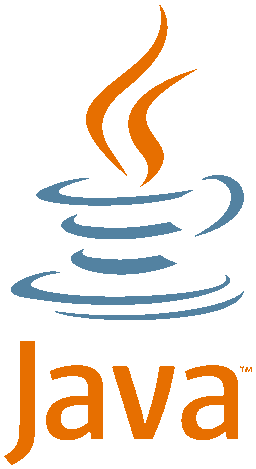

[[**Página inicial**](https://f4nt0.github.io/PR0GR4M1NG)]

# Página inicial da Linguagem Java

    

[**`GLOSSÁRIO`**]()

**Básico da Linguagem Java**

_EM MANUTENÇÃO_

---

**Orientado a Objetos com Java**

Link da página|Resumo
|---|---|
[Modelagem Básica de uma Classe](../prog_java/class_model.md)| Como construir uma Classe orientada a objetos com Java
[Construindo Classes Genéricas](../prog_java/genericos.md)| Como construir uma Classe Genérica em Java
[Trabalhando com Listas](../prog_java/listas.md)| Como construir e trabalhar com listas em Java
[Sobrecarga, Atributos e Metodos de Classe](../prog_java/sobrecarga.md)| Como mexer com Sobrecarga e Atributos e Metodos de uma Classe de Java
[Interface,Metodos Static,Metodos Default](../prog_java/interface.md)| Como trabalhar com Interfaces, Metodos Statics e Metodos Default em Java
[Trabalhando com Heranças](../prog_java/heranca.md)|Como mexer com Heranças em Java
[Classes Abstratas](../prog_java/classes_abstratas.md)| Como fazer uma Classe Abstrata em Java
[Polimorfismo](../prog_java/polimorfismo.md)| Como se organizar com Polimorfismo
[Como mexer com UML](../prog_java/uml.md) | Como organizar Diagramas em UML

