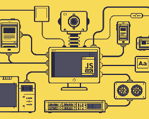

[[**Página inicial**](https://f4nt0.github.io/PR0GR4M1NG)]

---

# Página inicial da Linguagem Javascript

---

    

---

    <code style="color: gold">GLOSSÁRIO</code>

---

**Básico da Linguagem Javascript**

link da Página|Resumo
|---|---|
[Estruturas Básicas em Javascript](../prog_js/basico.md)| Entendo as Principais informações da Linguagem
[Matemática em Javascript](../prog_js/math.md)| Como funciona Matemática em Javascript
[Estruturas de Decisões e Repetições](../prog_js/dec-rep.md)| Como funcionam as Estruturas de Decisões e Repetições em Javascript
[Construindo Funções em Javascript](../prog_js/functions.md)| Estruturando e usando Funções em Javascript