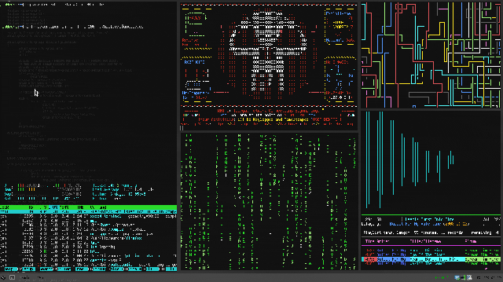

[[**Página inicial**](https://f4nt0.github.io/PR0GR4M1NG)]

---
# Página inicial sobre Shell CLI Unix
---

---

    <code style="color : gold">GLOSSÁRIO</code>

---

    <code style="color : greenyellow">Sistemas Operacionais Livres Populares </code>

    
    
    

 
 

    <code style="color : yellow">Melhor User Interface para essas Distros: </code>
    <code style="color : LawnGreen">Cinnamon</code>

 
 

## COMANDOS DE SHELL CLI

---

<code style="color: blueViolet">CLI</code> = <code style="color: blueViolet">C</code>ommand- <code style="color: blueViolet">L</code>ine <code style="color: blueViolet">I</code>nterface
 
 
<code style="color: gold">Shell CLI são os Famosos Terminais utilizados nos Computadores, onde de vez de termos uma Interface Gráfica(GUI),que o usuário comum utiliza, temos uma interface totalmente via texto onde dizemos ao computador o que ele deve fazer passando comandos entrados de teclado pelo Desenvolvedor!</code>

 
 

**Como iniciar um Shell CLI via Teclado**

    <code style="color : orange">Ctrl + Alt + T</code>

 

**Como Limpar a Visualização da Tela do Shell CLI**

 

    <code style="color : yellow">No Shell: </code>
    <code style="color : DodgerBlue">clear</code>
     
    <code style="color : yellow">No Teclado: </code>
    <code style="color : DodgerBlue">Ctrl + L</code>

 
 

## Comandos de Gerênciamento do Computador

Páginas|Informação|
|---|---|
[Instalação e Desinstalação de Programas](../shell_unix/ins_programs)| Gerenciamento de Programas no Linux
[Informação do Sistema Linux](../shell_unix/system)|Como adquirir informação do sistema
[Comandos de Controle de Diretorios](../shell_unix/directory)|Comandos de Gerencia de Diretorios
[Leitura e Renomeio de Arquivos](../shell_unix/files)|Gerencia de Arquivos
[Comandos de Compressão](../shell_unix/compress)|Descompressando arquivos
[Comandos de Network](../shell_unix/network)|Comandos de Network do Linux

 
 

## Como Configurar seu Shell

Link da Página|Resumo
|---|---|
[Configurando o seu PS1](../shell_unix/config-screen.md)| Como configurar a sua tela do Terminal

