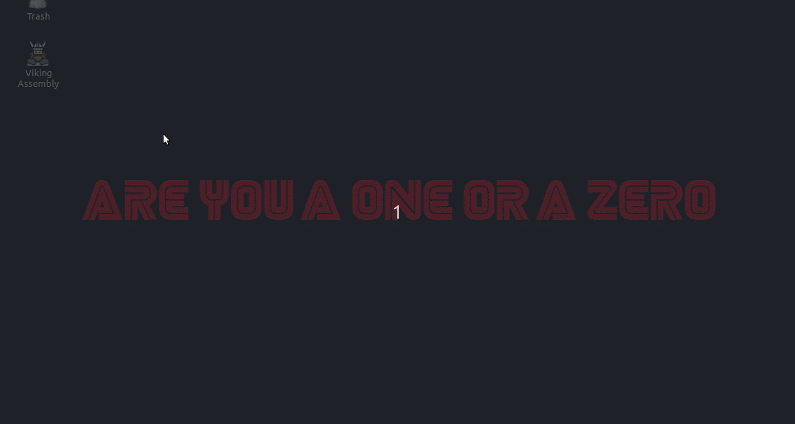

[[Página Inicial](../tut_config/home.md)]

# Alterando o tema do Ubuntu 18.04

1. Após baixar o Ubuntu 18.04, procure por `Tweaks`
2. No Tweaks procure por `Appearance`
3. Troque o tema em `Themes`

