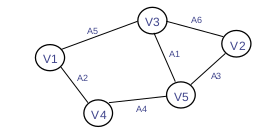
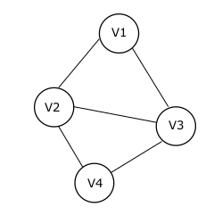
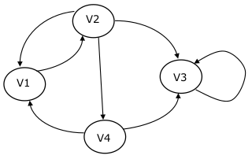

[[Página Inicial](../tut_ds/home.md)]

---

# Grafos

---

<code style="color: "></code>

<code style="color: gold">Grafos</code> é a Representação Abstrata mais utilizada na Modelagem de Sistemas e é utilizada para uma Ampla Variedade de Aplicações

De uma forma bem leiga: é um conjunto de Pontos que são conectados por várias Linhas

**Definição Teórica**

Um <code style="color: gold">Grafo</code> é um Conjunto Finito não Nulo que possui um Número <code style="color: red">n</code> de <code style="color: greenyellow">Vértices</code> com elementos conectados entre si com um número Par de <code style="color: aquamarine">Arestas</code>.

* <code style="color: aquamarine">Arestas</code> são as Linhas de Conexões entre os Vértices, sempre Pares

* <code style="color: greenyellow">Vértices</code> são Nodos que possuem um elemento dentro deles, onde são conectados com outros Vértices.

* Simbologia para Facilitar:
  * <code style="color: fuchsia">G</code> é o Grafo
  * <code style="color: aquamarine">A</code> é a Aresta
  * <code style="color: greenyellow">V</code> é o Vértice

Se quisermos apresentar os Vértices de um Grafo apresentamos assim: <code style="color: greenyellow">V</code>(<code style="color: fuchsia">G</code>) = {V1,V2,...}

Se quisermos apresentar as Arestas de um Grafo apresentamos assim: <code style="color: aquamarine">A</code>(<code style="color: fuchsia">G</code>) = {A1,A2,...}

Exemplo de grafo:

    

Seguindo a Instrução, este grafo pode ser visto assim:

<code style="color: greenyellow">V</code>(<code style="color: fuchsia">G</code>) = {<code style="color: greenyellow">V1</code>,<code style="color: greenyellow">V2</code>,<code style="color: greenyellow">V3</code>,<code style="color: greenyellow">V4</code>,<code style="color: greenyellow">V5</code>}

<code style="color: aquamarine">A</code>(<code style="color:fuchsia">G</code>) = {<code style="color: aquamarine">A1</code>,<code style="color: aquamarine">A2</code>,<code style="color: aquamarine">A3</code>,<code style="color: aquamarine">A4</code>,<code style="color: aquamarine">A5</code>,<code style="color: aquamarine">A6</code>}

---

    <code style="color: gold">Tipos de Grafos</code>

---

## Grafos não-dirigidos

* São Grafos onde:
  * As arestas não tem uma orientação específica
  * Não é preciso repetir a conexão dos vértices
    * (V1,V2) é o mesmo de (V2,V1)

Exemplo de Grafo, que chamaremos de <code style="color: fuchsia">G1</code>:

    

Neste Grafo, como explicado anteriormente, não tem uma Orientação específica entre os Vértices, onde por exemplo V1 pode tanto ir para V2 quanto V3, não tendo uma Orientação para qual dos dois ir primeiro.

Temos então a seguinte forma de Apresentação dos Vértices:

<code style="color: greenyellow">V</code>(<code style="color: fuchsia">G1</code>) = {<code style="color: greenyellow">V1</code>,<code style="color: GREENYELLOW">V2</code>,<code style="color: greenyellow">V3</code>,<code style="color: greenyellow">V4</code>}

Agora as Arestas, cada Vértice possui duas Conexões entre os outros Vértices, onde iremos apresentar essas Arestas sem repetir conxeções((V1,V2) = (V2,V1)):

<code style="color: aquamarine">A</code>(<code style="color: fuchsia">G1</code>) = {(<code style="color: aquamarine">V1</code>,<code style="color: aquamarine">V2</code>),(<code style="color: aquamarine">V1</code>,<code style="color: aquamarine">V3</code>),(<code style="color: aquamarine">V2</code>,<code style="color: aquamarine">V3</code>),(<code style="color: aquamarine">V2</code>,<code style="color: aquamarine">V4</code>),(<code style="color: aquamarine">V3</code>,<code style="color: aquamarine">V4</code>)}

## Grafos Dirigidos

* São Grafos onde:
  * As Arestas Possuem uma Orientação Fixa
  * Cada conexão de Vértices é diferente da outra, cada uma deve ser apresentada
  * O Vértice que estamos olhando é chamado de <code style="color: gold">Origem</code> e o Vértice conectado a ele é chamado de <code style="color: gold">Destino</code>

Exemplo de Grafo que Chamaremos de <code style="color: fuchsia">G2</code>:

    

Como se pode ver no Grafo, as Setas é a Ordem de Conexão do Grafo, que é Fixa,deve ser respeitada, onde podemos andar pelos Grafos seguindo o Fluxo.

Apresentação do Vértices de nosso Grafo:
    
<code style="color: greenyellow">V</code>(<code style="color: fuchsia">G2</code>) = {<code style="color: greenyellow">V1</code>,<code style="color: greenyellow">V2</code>,<code style="color: greenyellow">V3</code>,<code style="color: greenyellow">V4</code>}

As Arestas devem ser vistas a partir da conexões e o Vértice que estamos olhando, se formos ser mais firmes sobre as conexões, pelo nosso vértice podemos ver o seguinte:

* <code style="color: greenyellow">V1</code> é <code style="color: tomato">ORIGEM</code> e <code style="color: greenyellow">V2</code> é <code style="color: tomato">DESTINO</code>
* <code style="color: greenyellow">V2</code> é <code style="color: tomato">ORIGEM</code> e <code style="color: greenyellow">V1</code> é <code style="color: tomato">DESTINO</code>
* <code style="color: greenyellow">V2</code> é <code style="color: tomato">ORIGEM</code> e <code style="color: greenyellow">V4</code> é <code style="color: tomato">DESTINO</code>
* <code style="color: greenyellow">V2</code> é <code style="color: tomato">ORIGEM</code> e <code style="color: greenyellow">V3</code> é <code style="color: tomato">DESTINO</code>
* <code style="color: greenyellow">V3</code> é <code style="color: tomato">ORIGEM</code> e <code style="color: greenyellow">V3</code> é <code style="color: tomato">DESTINO</code>
* <code style="color: greenyellow">V4</code> é <code style="color: tomato">ORIGEM</code> e <code style="color: greenyellow">V3</code> é <code style="color: tomato">DESTINO</code>
* <code style="color: greenyellow">V4</code> é <code style="color: tomato">ORIGEM</code> e <code style="color: greenyellow">V1</code> é <code style="color: tomato">DESTINO</code>

Podemos apresentar isso da Seguinte forma:

<code style="color : aquamarine">A</code>(<code style="color : fuchsia">G2</code>) = {(<code style="color : aquamarine">V1</code>,<code style="color : aquamarine">V2</code>),(<code style="color : aquamarine">V2</code>,<code style="color : aquamarine">V1</code>),(<code style="color : aquamarine">V2</code>,<code style="color : aquamarine">V4</code>),(<code style="color : aquamarine">V2</code>,<code style="color : aquamarine">V3</code>),(<code style="color : aquamarine">V3</code>,<code style="color : aquamarine">V3</code>),(<code style="color : aquamarine">V4</code>,<code style="color : aquamarine">V3</code>),(<code style="color : aquamarine">V4</code>,<code style="color : aquamarine">V1</code>)}

Portanto em Resumo temos as seguintes verificações:

---

    

<code style="color: greenyellow">V</code>(<code style="color: fuchsia">G1</code>) = {<code style="color: greenyellow">V1</code>,<code style="color: GREENYELLOW">V2</code>,<code style="color: greenyellow">V3</code>,<code style="color: greenyellow">V4</code>}

<code style="color: aquamarine">A</code>(<code style="color: fuchsia">G1</code>) = {(<code style="color: aquamarine">V1</code>,<code style="color: aquamarine">V2</code>),(<code style="color: aquamarine">V1</code>,<code style="color: aquamarine">V3</code>),(<code style="color: aquamarine">V2</code>,<code style="color: aquamarine">V3</code>),(<code style="color: aquamarine">V2</code>,<code style="color: aquamarine">V4</code>),(<code style="color: aquamarine">V3</code>,<code style="color: aquamarine">V4</code>)}

    

<code style="color: greenyellow">V</code>(<code style="color: fuchsia">G2</code>) = {<code style="color: greenyellow">V1</code>,<code style="color: greenyellow">V2</code>,<code style="color: greenyellow">V3</code>,<code style="color: greenyellow">V4</code>}

<code style="color : aquamarine">A</code>(<code style="color : fuchsia">G2</code>) = {(<code style="color : aquamarine">V1</code>,<code style="color : aquamarine">V2</code>),(<code style="color : aquamarine">V2</code>,<code style="color : aquamarine">V1</code>),(<code style="color : aquamarine">V2</code>,<code style="color : aquamarine">V4</code>),(<code style="color : aquamarine">V2</code>,<code style="color : aquamarine">V3</code>),(<code style="color : aquamarine">V3</code>,<code style="color : aquamarine">V3</code>),(<code style="color : aquamarine">V4</code>,<code style="color : aquamarine">V3</code>),(<code style="color : aquamarine">V4</code>,<code style="color : aquamarine">V1</code>)}

---

---

    <code style="color : gold">Relações</code>

---

