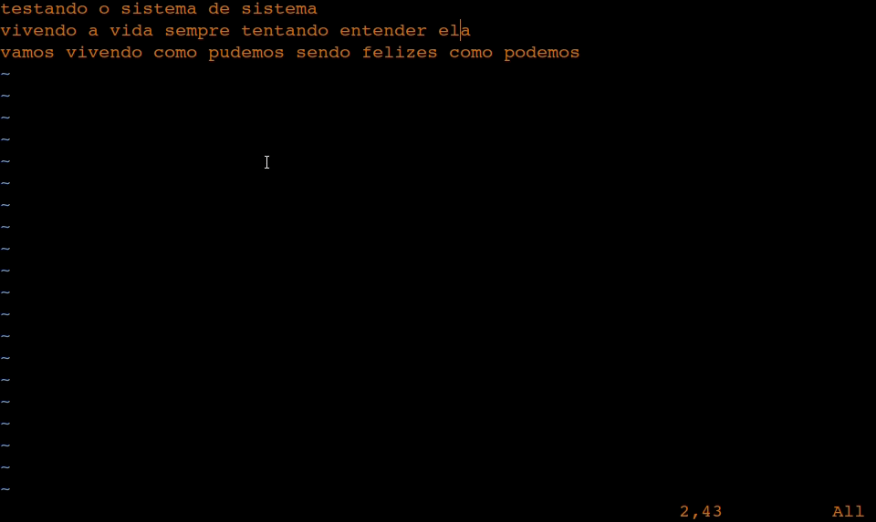
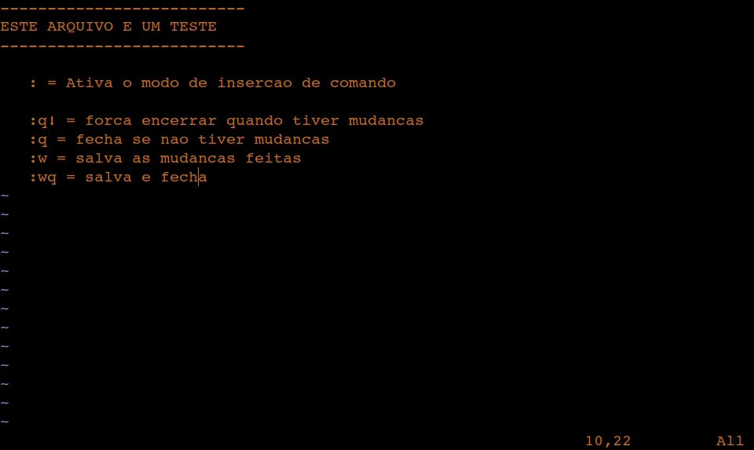

[[**Página inicial**](https://f4nt0.github.io/PR0GR4M1NG)]

 

# Página sobre VI e VIM

 

    

 
 

Editor de Texto via Terminal para desenvolvimento de codigo mais Rapido 

 
 

    <code style="color : yellowgreen">Instalando via Terminal: </code><code style="color : lightblue">sudo apt-get install vim</code>

 
 

    <code style="color : yellowgreen">Iniciando via Terminal: </code><code style="color : lightblue">vim </code><code style="color : tomato">nomedoarquivo.extensao</code>

 
 

## MODO DE INSERCAO

 
 

    <code style="color : yellowgreen">Iniciando o modo de insercao</code>
     
    <code style="color : tomato">i</code>
     
     
    Clique no botao do teclado <code style="color : tomato">i</code> no VI e VIM para ativar o modo de insercao de texto
     
     
    Para Sair do modo de Insercao clique em <code style="color : lightblue">ESC</code>
     
    O modo de comandos so funciona fora do modo de insercao
     
     
    <code style="color : orange">Exemplo</code>
     
    

 
 

## MODO DE COMANDOS

 
 

    <code style="color : yellowgreen">Iniciando modo de comandos do vi e vim </code>
     
    <code style="color : tomato">:</code>
     
     
    Apos ativar o modo de comando com <code style="color : tomato">:</code> escreva o comando que deseja.
     
     
    Para ativar o comando clique em <code style="color : lightblue">ENTER</code>
     
     
    <code style="color : orange">Exemplo</code>
    

 

     
    Para ativar os numeros das paginas, digite o seguinte comando:
     
     
    <code style="color : tomato">:</code><code style="color : magenta">set nu</code>
     
    E depois clique em <code style="color : lightblue">ENTER</code>
     
     
    <code style="color : orange">Exemplo</code>
     
    

 

### Lista de comandos

Comando | Para que serve
|---|---|
<code style="color : magenta">q</code>| Fecha o arquivo se nada foi modificado
<code style="color : magenta">q!</code>| Encerra o programa forçadamente, apagando todas as mudanças
<code style="color : magenta">w</code>| Salva o arquivo que foi modificado
<code style="color : magenta">wq</code>| Salva o arquivo e o fecha automaticamente
<code style="color : magenta">set nu</code>| Ativa os numeros das linhas do arquivo
<code style="color : magenta">sh</code>| Volta para o shell fora do arquivo, para voltar ao arquivo clique em <code style="color : lightblue">CTRL + D</code>

 
 

## MODO DE PESQUISA

 
 

    <code style="color : yellowgreen">Pesquisa procurando palavras anteriores </code>
     
    <code style="color : tomato">/</code>
     
     
    <code style="color : white">Exemplo:</code>
     
     
    <code style="color : tomato">/</code><code style="color : lightblue">palavra</code>
     

 
 

    <code style="color : yellowgreen">Pesquisa procurando palavras mais a frente </code>
     
    <code style="color : tomato">?</code>
     
     
    <code style="color : white">Exemplo:</code>
     
     
    <code style="color : tomato">?</code><code style="color : lightblue">palavra</code>

 
 

    <code style="color : orange">Exemplo</code>
     
     
    Apos escolhido uma das opcoes, coloque a palavra que procura e clique em ENTER para ir a palavra que procura
     
    

### Lista de Comandos para pesquisa

Comando|Para que serve
|---|---|
<code style="color : magenta">/</code>| Pesquisa uma palavra que ja foi escrita, antes do mouse
<code style="color : magenta">?</code>| Pesquisa uma palavra que esta escrita depois do mouse
<code style="color : magenta">n</code> | Refaz a pesquisa novamente

 
 

## COMANDOS DE TECLADO UTEIS

    Estes comandos servem para modificar o texto fora da forma de insercao, muito uteis para trabalhar com os arquivos

 

 

Comando|Para que serve
|---|---|
<code style="color : magenta">dd</code> | Deleta uma linha inteira
<code style="color : magenta">x</code>| Deleta a letra vinda depois do cursor
<code style="color : magenta">l</code>| Move o Cursor para a Direita na Linha Atual
<code style="color : magenta">h</code>| Move o Cursor para a Esquerda na Linha Atual
<code style="color : magenta">j</code>| Move o Cursor para a Linha Abaixo
<code style="color : magenta">k</code>| Move o Cursor para a Linha Acima

 

## CTRL C + CTRL V NO VI E VIM

    <code style="color : lightgreen">ATIVE O MODO DE VISUAL</code>
     
     
    <code style="color : magenta">v</code>
     
    <code style="color : yellow">Marca palavra por palavra na linha(use as setas para ir marcando)</code>
     
     
    <code style="color : magenta">V</code>
     
    <code style="color : yellow">Marca a Linha inteira onde o Cursor estiver</code>
     
     
    <code style="color : orange">Exemplo</code>
     
    

 

    <code style="color : lightgreen">COMANDO DE COPIA</code>
     
     
    <code style="color : magenta">y</code>
     
    <code style="color : yellow">No modo Visual, apos selecionado o texto desejado, clique em y para copiar o texto</code>
     
     
    <code style="color : magenta">yy</code>
     
    <code style="color : yellow">Fora de qualquer sistema, copia toda a linha do cursor</code>

 
 

    <code style="color : lightgreen">COMANDO DE COLAR</code>
     
     
    <code style="color : magenta">p</code>
     
    <code style="color : yellow">Se direcione a linha que deseja e clique em p para colar o que foi copiado antes do cursor</code>   
     
     
    <code style="color : magenta">P</code>
     
    <code style="color : yellow">Se direcione a linha que deseja e clique em p para colar o que foi copiado depois do cursor</code>
     
     
    <code style="color : orange">Exemplo</code>
     
    

 
 

    <code style="color : lightgreen">COPIANDO E SALVANDO EM OUTRO ARQUIVO</code>
     
     
    <code style="color : lightblue">1. Ative o modo visual com a tecla </code><code style="color : red ">v</code>
     
    <code style="color : lightblue">2. Ande com o as setas ate selecionar tudo que deseja copiar</code>
     
    <code style="color : lightblue">3. Selecione a tecla</code><code style="color : red"> y</code>
     
    <code style="color : lightblue">4. Ative a area de comando com</code><code style="color : red"> :</code>
     
    <code style="color : lightblue">5. Coloque o comando</code><code style="color : red"> sh</code>
     
    <code style="color : lightblue">6. Va ate o arquivo desejado que deseja colar o texto</code>
     
    <code style="color : lightblue">7. Abra o arquivo no VI ou VIM</code>
     
    <code style="color : lightblue">8. Apos aberto o arquivo va ate a linha desejada com as setas ou com j,k,h,l</code>
     
    <code style="color : lightblue">9. Cole o texto com</code><code style="color : red"> p</code><code style="color : lightblue"> ou</code><code style="color : red"> P</code>
     
    <code style="color : lightblue">10. Salve o Arquivo</code>
     
    <code style="color : lightblue">11. Se quiser voltar ao arquivo anterior, volte ao terminal e selecione no teclado</code><code style="color : red"> CTRL + D</code>
     
     
    <code style="color : orange">Exemplo</code>
     
    

