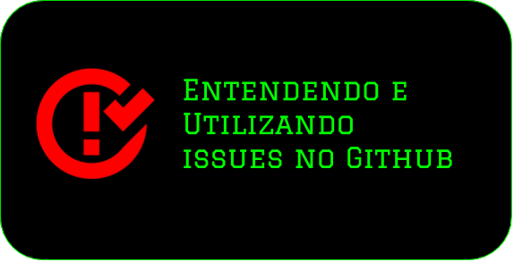
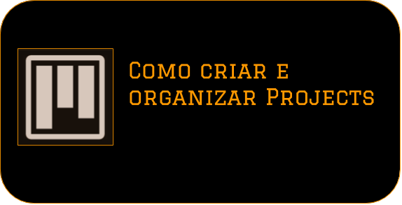

# Meus Vídeos sobre Repositórios e Git

---

* <code style="color: orange">Comecei a Fazer Vídeos de Tutoriais de como Trabalhar com Git e o Github, para que as pessoas que estudam comigo ou trabalhem tenham uma base de como funciona essas tecnologias para que o nosso trabalho renda mais</code>

---

    

---

## Vídeos sobre o Gerênciamento no Github

---

---

---